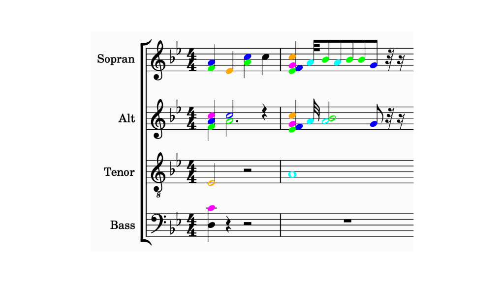

# Musescore Plugins
This Repo contains two plugins (only tested with MuseScore 4.5, should work with >= 4.4).
- [Color Same Notes](#color-same-notes)
- [Voice Remover](#voice-remover)

## How to Install

#### Download
Link: https://github.com/Kavakuo/MuseScore-Plugins/releases


#### Install
Copy the plugins folder to the following location for your OS:
- Windows: `C:\Users\[Your User Name]\Documents\MuseScore4\Plugins\`
- macOS: `~/Documents/MuseScore4/Plugins/`
- Linux: `~/Documents/MuseScore4/Plugins`

Restart MuseScore and activate the Plugins.


## Color Same Notes
A helpful plugin during arranging. It colors notes across different staffs that sound at the same time.

There is currently a limitation in the MuseScore Extension API regarding notifications when something changed. Therefore, if the pitch of a note is changed the plugin must be executed again.




## Voice Remover
A helpful plugin to create audio exports that only contain a certain voice of a staff. The plugin allows to remove all voices except one. Some scores only contain multiple voices in certain measures. Therefore, it is possible to specify a "Main voice" that is kept in case no other voices have notes in the same measure.

#### Plugin UI


#### Before -> After


## Development
The repo contains TypeScript Definitions for the MuseScore Plugin API (`src/musescore.d.ts`). The definitions were mostly generated by AI from the C++ header files, so there might be a few issues, but feel free to use them.

### Compile from Scratch
```shell
npm install
npm run build

```

### "Debug" Workflow
Start MuseScore in debug mode and observe the console output.
- macOS: `/Applications/MuseScore\ 4.app/Contents/MacOS/mscore -d`


